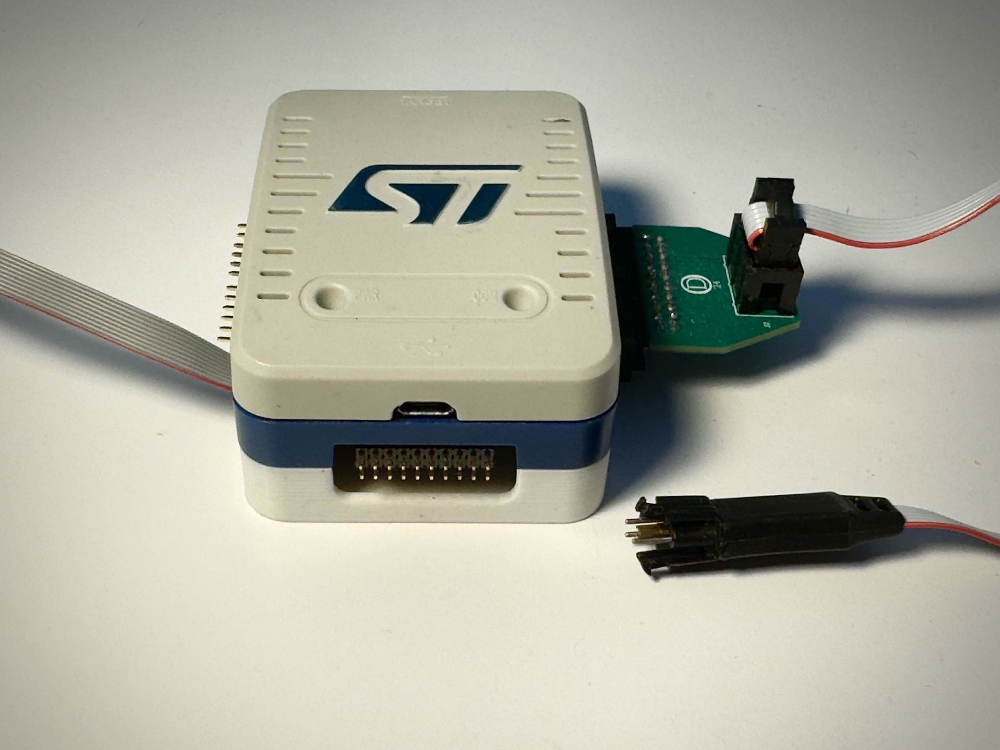
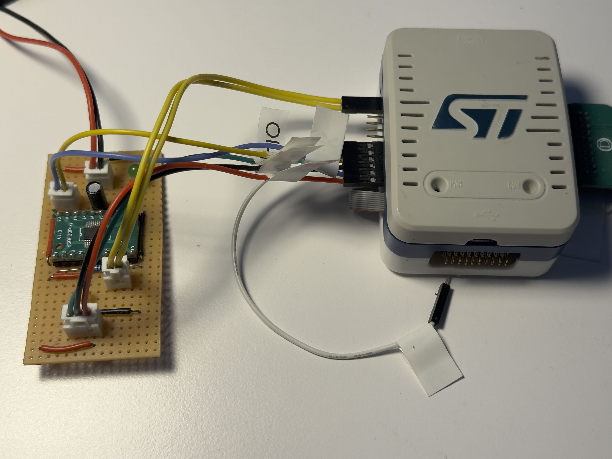
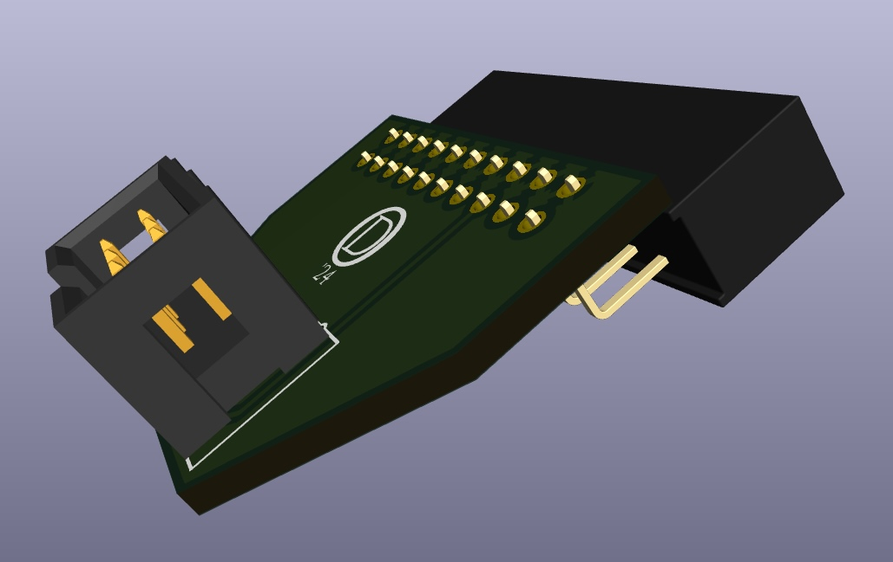
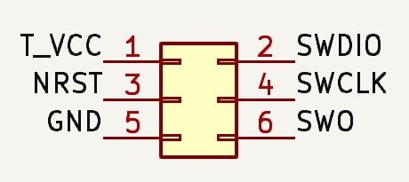

# STLINKV3 Modification

This repository contains two things:

* A modification of the **STLINK-V3** debugger that adds a back when the **MB1440** board is used. 

* A simple board that allows to connect a 6-pin Tag-Connect **TC2030** to the **JTAG** connector (CN2) of the MB1440 board.

## The back

When one adds the MB1440 board to the STLINK one can no longer use the provided back to close the debugger. The debugger than lies upside down and the LEDs not visible anymore.

The folder **st_link_bottom** contains the 3mf file to print the lower back. It looks like this

The cutouts are big enough to give easy access to the connectors on the MB1440 board. I use the connector on the right with the TC2030 and the connector on the left (CN6) for prototype boards.

## The JTAG to 6-pin board.

The folder **jtag** contains the gerber files for the JTAG-to-6 pin connector. 

The pinout of the 6-pin connector is as follows:

